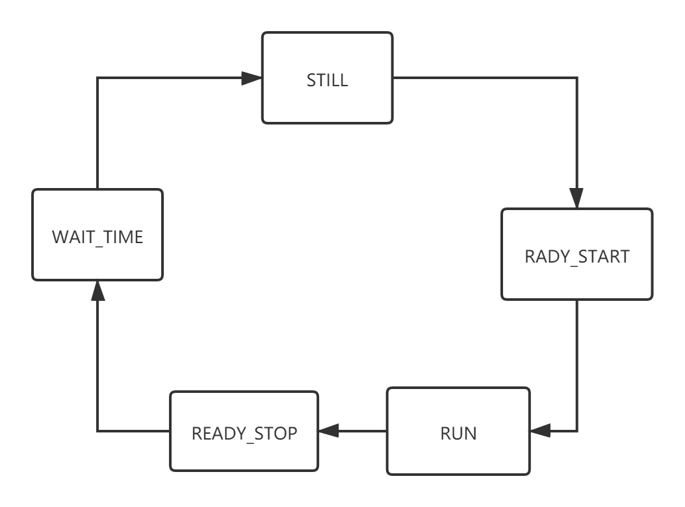

# 进程管理——电梯调度系统

* **学号**：1851049
* **姓名**：陈中悦


## 项目目的

1. 学习调度算法
2. 通过控制电梯调度，体会操作系统调度过程
3. 学习特定环境下多线程编程方法


## 开发环境

* 开发环境：Windows 10
* 开发工具：**PyCharm** *2020.1.3  PC-201.8538.36*

* 开发语言：python

  引用模块：

  > PyQt5==5.15.4


## 项目需求

### 基本任务

某一栋楼20层，有5部互联的电梯。基于线程的思想，编写一个电梯调度程序。

五部电梯门口的按钮是互联结的，即当外部请求按钮按下去时，需要操作系统选择一部电梯来响应这个请求。

所有电梯初始状态都在第一层，无按钮被按下。每个电梯如果在它的上层或者下层没有相应请求情况下，则应该在原地保持不动。


## 项目演示

安装好<u>依赖的第三方库</u>，在项目文件夹下<u>终端输入</u>:

```python
python ElevatorDispatch.py
```


## 项目展示

#### 界面说明


#### 内部命令


#### 外部命令


#### 开关门命令


#### 报警器命令


## 系统设计

#### 核心变量设计

|         电梯状态         |  值  |  乘客选择状态   |  值  |    时间     |  值  |
| :----------------------: | :--: | :-------------: | :--: | :---------: | :--: |
|  RUNNING_UP（向上运行）  |  0   |  GO_UP（上行）  |  0   |  RUN_TIME   |  1   |
| RUNNING_DOWN（向下运行） |  1   | GO_DOWN（下行） |  1   |  WAIT_TIME  |  3   |
|      STILL（静止）       |  2   |   NONE（无）    |  2   | WAIT_TIME_2 |  4   |
|                          |      |                 |      | WAIT_TIME_3 |  5   |

|      警报状态       | 值   |        门的管理         | 值   |        动画状态         | 值   |
| :-----------------: | ---- | :---------------------: | ---- | :---------------------: | ---- |
| DISABLE（电梯可用） | 0    |    OPEN_DOOR（开门）    | 0    | READY_START（就绪运行） | 0    |
| USABLE（电梯损坏）  | 1    |   CLOSE_DOOR（关门）    | 1    | READY_STOP（就绪停止）  | 1    |
|                     |      | DOOR_CLOSED（门在关着） | 0    |     NOPE（空状态）      | 2    |
|                     |      | DOOR_OPENED（门在开着） | 1    |                         |      |

#### 类设计

* 核心控制类`Controller`

  ```python
  class Controller(object):
  	def __init__(self,n,UI):
  
      def _calTime(self, elev, whichFloor): # 计算预期时间
      def externDis(self,whichFloor,choice): # 外部命令调度函数
  
      def internDis(self,elev,targetFloor): # 内部命令调度函数
  
      def doorsCtrl(self,elev,cmd): # 开关门控制函数
      def openDoorAnim(self,elev): # 开门动画
      def closeDoorAnim(self,elev: # 关门动画
  
      def warnsCtrl(self,elev): # 警报器控制函数
  
      def updateState(self): # 状态更新函数
  ```

* UI窗口类`Ui_Window`

  ```python
  class Ui_Window(object):
      def __init__(self):
      
      def setupUi(self, MainWindow): # 生成ui所需控件
      def retranslateUi(self, MainWindow):# ui控件添加文字
  
      def doorsClick(self): # 开关门按钮响应函数
      
      def cmdClick(self): # 上下行按钮响应函数
  
      def warnClick(self): # 警报器按钮响应函数
      
      def levelClick(self): # 内部楼层按钮响应函数
  ```

* 界面显示类`Elevator`

  ```python
  class Elevator(QMainWindow,ElevatorUI.Ui_Window):
      def __init__(self)
  ```

  

## 系统实现

### 内部命令

* **核心算法**：**LOOK算法**

  电梯调度的核心是 SCAN 算法，这是操作系统用于磁盘调度的算法之一。SCAN 算法的核心思想非常简单，就是在一条路上来来回回的走，一个方向上走到头之后换反方向再走到头。

  LOOK算法是SCAN算法的一种改进。对LOOK算法而言，电梯同样在最底层和最顶层之间运行。但当LOOK算法发现<u>电梯所移动的方向上**不再有请求时**立即改变运行方向</u>，而扫描算法则需要移动到最底层或者最顶层时才改变运行方向。

* **具体实现**：

  * 若`targetLevel`>`curLevel`:
    * 若电梯 *向上运动或静止*，将`targetLevel`加入该电梯<u>顺行命令列表并将其排序</u>
    * 若电梯 *向下运动，*将`targetLevel`加入该电梯<u>逆行命令列表将其排序</u>
  * 若`targetLevel<curLevel`：
    * 若电梯 *向上运动*，将`targetLevel`加入该电梯<u>逆行命令列表并将其逆序</u>
    * 若电梯 *向下运动或静止*，将`targetLevel`加入该电梯<u>顺行命令列表并将其逆序</u>
    
  * 若`targetLevel=curLevel`:
    * 若电梯 *静止*，<u>直接响应</u>该命令，播放开门动画并将该按钮样式、可用性复原
    * 若电梯 *非静止*，将该命令<u>加入该电梯逆行命令列表</u>

* **核心代码：**（详细代码见dispatch.py)

  ```python
           # 目标楼层更高
          if targetFloor>curLevel:
              ## 若此电梯在静止
              	## 直接加入顺行列表并排序（代码略）
              ## 若电梯非静止
                  if self.elev_state[elev]==RUNNING_UP:
                      ## 加入顺行列表并排序（代码略）
                  else:
                      ## 加入逆行列表并排序（代码略）
  
          # 目标楼层更低
          elif targetFloor<curLevel:
              ## 若此电梯在静止
              	## 直接加入顺行列表并排序（代码略）
              ## 若电梯非静止
                  if self.elev_state[elev]==RUNNING_DOWN:
                      ## 加入顺行列表并排序（代码略）
                  else:
                      ## 加入逆行列表并排序（代码略）
  
          # 就在目标楼层
          else:
              ## 若此电梯静止
              	## 直接开门
              ## 电梯非静止
              	## 加入逆行列表并排序（代码略）
  ```

### 外部命令

* **核心算法：**

  若此楼层当前<u>已有命令待响应，忽略此次命令</u>；反之<u>计算所有可用电梯预期响应命令时间</u>，选择<u>预期用时最短</u>电梯作为响应电梯，同时其他电梯<u>忽略该命令</u>。

  根据该电梯当前状态以及目标楼层，判断将该命令加入顺行或逆行命令列表，判断方式同上述内部命令。

* **外部命令处理函数：**
  
  * 若`whichLevel`楼层当前 *已有命令待执行*：<u>忽略</u>此次命令
  * 若`whichLevel`楼层当前 *未有命令待执行*：
  
    * 使用`_calTime()`函数计算5部电梯<u>预期响应该命令所需时间</u>，
    * 选择预期响应<u>用时最短</u>的电梯`BESTELEV`作为命令响应电梯，同时<u>其他电梯忽略</u>该命令。
  
* **时间计算函数：**

  *  若 *电梯静止*，t=|`curLevel`-`whichLevel`|*`RUN_TIME`
  
  * 若 *电梯运行*
  
    * 顺路 *可到达*：
  
      t=|`curLevel`-`whichLevel`|*`RUN_TIME`+中途预期停靠次数\*`WAIT_TIME`
  
    * 顺路 *不可达*：
  
      (`com_end_level`表示顺行最后一个命令楼层)
  
      t=|`curLevel`-`com_end_level`|*`RUN_TIME`+中途预期停靠次数\*`WAIT_TIME`+|`com_end_level`-`whichLevel`|\*`RUN_time`

* **核心代码：**（详细代码见dispatch.py)

  ```python
  		"""计算预期时间核心伪代码"""
          # 若电梯静止
          if self.elev_state[elev]==STILL:
              t=abs(self.cur_level[elev]-whichFloor)*RUN_TIME
          else:
              ## 若顺行方向
                  ## 计算途径解决命令数 c（代码略）
                  t=abs(self.cur_level[elev]-whichFloor)*RUN_TIME+c*WAIT_TIME
              ## 若不顺行
                  com_end_level=self.com_list[elev][-1] # 正向运行到的最后一个楼层
                  cur_level=self.cur_level[elev] # 该电梯此时所处楼层
                  t=abs(cur_level-com_end_level)*RUN_TIME+len(self.com_list[elev])*WAIT_TIME # 顺行运行到底的时间
                  t+=abs(com_end_level-whichFloor)*RUN_TIME # 反向运行到目标楼层时间(忽略其中开门等待等用时）
  
  			'''外部调度核心伪代码'''
             ## 筛选可用电梯列表 ableElev(代码略)
             ## 计算ableElev中各电梯预期运行时间（代码略）
             BESTELEV=pick_time.index(min(pick_time))
             
             # 加入该电梯命令队列
             # 若该电梯已有命令
              if self.com_list[BESTELEV]:
                  cur_level=self.cur_level[BESTELEV] # 该电梯当前楼层
                  elev_state=self.elev_state[BESTELEV] # 该电梯运行状态
                  ## 不顺路，则加入反向列表并排序（代码略）
                  ## 顺路，则加入正向列表并排序（代码略）
              # 若该电梯没有命令
              else:
                  ## 加入正向列表并排序（代码略）
  ```
  
  

### 电梯状态更新

控制对象中设置计时器，每经过1s调用一次`updateState`函数，以更新各电梯状态并作出相应的UI效果。

电梯主要有`STILL`，`RUNNING_UP`,`RUNNING_DOWN`三状态，电梯动画有`READY_START`,`READY_STOP`,`WAIT_TIME`等状态。每次检查电梯当前所处状态，按照时间逻辑顺序进行状态转换并执行相应的逻辑和UI操作。

* **转换图：**

  

* **核心代码:**（详细代码见dispatch.py)

  ```python
          for elev in range(self.elevNum):
              ## 根据动画状态控制电梯门按钮打开后自动关闭
              if self.elev_anim_state[elev]==WAIT_TIME_3:
                  ## 自动关门（代码略）
  
              if self.elev_anim_state[elev]==WAIT_TIME_2:
                  ## 转为WAIT_TIME_3 （代码略）
  
              if self.door_ctrl_state[elev] ==OPEN_DOOR:
                  ## 转为WAIT_TIME_2（代码略）
  
              # 不可用电梯略过
              if self.warn_state[elev] == DISABLE:
                  continue
  
              # 若电梯可用且命令队列非空
              if self.com_list[elev]:
                  # 门在开着，等着关门
                  if self.doorsState[elev]==DOOR_OPENED:
                      continue
                  # 电梯静止状态
                  if self.elev_state[elev]==STILL:
                      ## 根据顺行指令列表更新电梯运行状态（代码略）                 
                      self.elev_anim_state[elev]=READY_START # 静止==>就绪运行
                  # 就绪运行状态
                  if self.elev_anim_state[elev]==READY_START:
                      self.closeDoorAnim(elev)
                      self.elev_anim_state[elev]=NOPE # 动画置空
                      print("就绪运行状态，发生了关门")
                  # 换客时间
                  if self.elev_anim_state[elev]==READY_STOP:
                      self.elev_anim_state[elev]=WAIT_TIME
                      continue
                  # 就绪停止状态
                  if self.elev_anim_state[elev]==WAIT_TIME:
                      ## 结束当前指令并进行ui转换（代码略）
                      self.elev_anim_state[elev]=NOPE # 动画置空
                      self.elev_state[elev]=STILL # 就绪停止==>静止
                      
                  elif self.warn_state[elev]==USABLE:
                      ## 若尚未到达下一个命令楼层，更新电梯当前楼层以及ui等（代码略）
                      ## 若已到达下一命令楼层
                          ##  内部电梯按钮ui复原（代码略）                        
                          self.elev_anim_state[elev]=READY_STOP  # 运行==> 就绪停止
  
              # 若反向命令队列非空
              elif self.com_reverse_list[elev]:
                  self.com_list[elev]=self.com_reverse_list[elev].copy()
                  self.com_reverse_list[elev].clear()
  ```
  
  

### 其他命令

#### 警报器控制函数

* 若电梯此时 *静止* 并且 *警报按钮可用* ，<u>进行响应</u>

* **核心代码：**（详细代码见dispatch.py)

  ```python
          if self.elev_state[elev]==STILL and self.warn_state[elev]==USABLE:
              self.warn_state[elev]=DISABLE
              ## ui变换（代码略）
              ## 内部电梯按钮禁用（代码略）
              ## 内部开关门按钮禁用（代码略）
              ## 内部报警按钮禁用（代码略）
              ## 电梯自动应答关闭（代码略）
  ```

#### 开关门控制函数

* 若电梯此时 *静止* 且 *非警报状态* ，<u>进行响应</u>：

  * 若电梯门处于`DOOR_CLOSED`且命令为`OPEN_DOOR`,进行<u>开门操作</u>
  * 若电梯门处于`DOOR_OPENED`且命令为`CLOSE_DOOR`,进行<u>关门操作</u>

* **核心代码：**（详细代码见dispatch.py)

  ```python
          # 静止状态可用的电梯才能控制门
          if self.elev_state[elev]==STILL:
              # 开门命令
              if cmd==OPEN_DOOR:
                  if self.doorsState[elev]==DOOR_CLOSED:
                      self.warn_state[elev]=DISABLE # 此电梯禁用
                      self.door_ctrl_state[elev]=OPEN_DOOR # 标识此时按下了开门
                      # 开门
                      self.doorsState[elev] = DOOR_OPENED
                      self.openDoorAnim(elev)
              else:
                  if self.doorsState[elev] == DOOR_OPENED:
                      self.warn_state[elev] = USABLE  # 此电梯启用
                      # 关门
                      self.doorsState[elev] = DOOR_CLOSED
                      self.closeDoorAnim(elev)
  ```
  
  