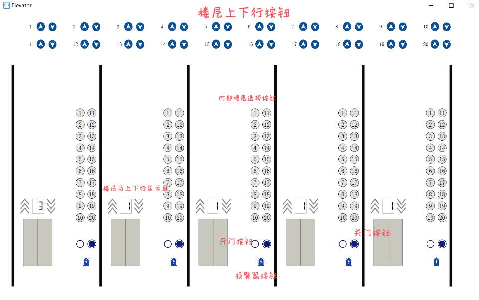
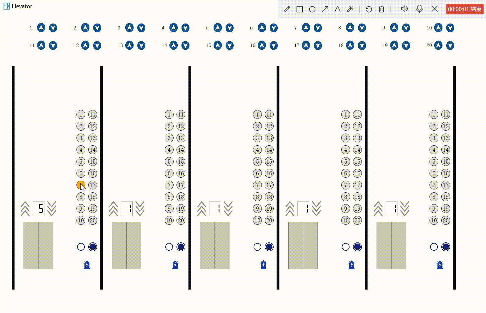
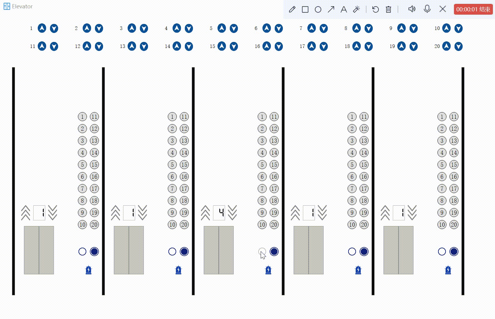
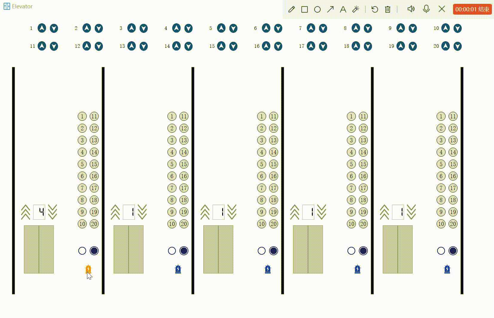

# 进程管理——电梯调度系统


## 项目目的

1. 学习调度算法
2. 通过控制电梯调度，体会操作系统调度过程
3. 学习特定环境下多线程编程方法


## 开发环境

* 开发环境：Windows 10
* 开发工具：**PyCharm** *2020.1.3  PC-201.8538.36*

* 开发语言：python

  主要引用模块：

  > PyQt5==5.15.4


## 项目结构

```
├─resources
│  ├─btn
│  │      close_hover.png
│  │      close_n.png
│  │      close_pressed.png
│  │      down_btn_normal.png
│  │      down_btn_pressed.png
│  │      open_hover.png
│  │      open_n.png
│  │      open_pressed.png
│  │      up_btn_normal.png
│  │      up_btn_pressed.png
│  │
│  ├─icon
│  │      icon.png
│  │
│  ├─screen
│  │      down.png
│  │      down_2.png
│  │      up.png
│  │      up_2.png
│  │
│  └─warn
│          a_warn.png
│          warn.png
|
│  dispatch.py
│  ElevatorDispatch.py
│  ElevatorUI.py
│  requirements.txt
```


## 项目需求

### 基本任务

某一栋楼20层，有5部互联的电梯。基于线程的思想，编写一个电梯调度程序。

五部电梯门口的按钮是互联结的，即当外部请求按钮按下去时，需要操作系统选择一部电梯来响应这个请求。

所有电梯初始状态都在第一层，无按钮被按下。每个电梯如果在它的上层或者下层没有相应请求情况下，则应该在原地保持不动。


## 项目演示

安装好依赖的第三方库，在项目文件夹下终端输入:

```python
python ElevatorDispatch.py
```


## 项目展示


#### 界面说明




####  内部命令




#### 外部命令


#### 开关门命令




#### 警报器命令




##  系统分析

### 电梯内部命令处理

* 触发事件：电梯内部乘客点击楼层按钮

* 响应条件：该电梯处于非警报状态

* 符号说明：电梯当前楼层`curLevel`，目标楼层`targetLevel`

* 预期响应：

  * 若`targetLevel`>`curLevel`:
    * 若电梯静止，将`targetLevel`加入该电梯顺行命令列表
    * 若电梯向上运动，将`targetLevel`加入该电梯顺行命令列表
    * 若电梯向下运动，将`targetLevel`加入该电梯逆行命令列表
  * 若`targetLevel<curLevel`：
    * 若电梯静止，将`targetLevel`加入该电梯顺行命令列表
    * 若电梯向上运动，将`targetLevel`加入该电梯逆行命令列表
    * 若电梯向下运动，将`targetLevel`加入该电梯顺行命令列表

  * 若`targetLevel=curLevel`:
    * 若电梯静止，直接响应该命令
    * 若电梯非静止，将该命令加入该电梯逆行命令列表


### 外部楼层命令处理

* 触发事件：某楼层乘客点击上行或下行按钮
* 响应条件：5部电梯非全部处于警报状态
* 符号说明：该乘客所在楼层`whichLevel`，乘客预定义较大值（1000）`INFINITY`
* 预期响应：
  * 若`whichLevel`楼层当前已有命令待执行：忽略此次命令
  * 若`whichLevel`楼层当前未有命令待执行：
    1. 使用`_calTime()`函数计算5部电梯预期响应该命令所需时间，
       * 非警报状态电梯：根据电梯当前楼层，运行状态及方向，待处理命令列表 计算预期响应用时；
       * 警报状态电梯：默认响应时间为`INFINITY`
    2. 选择预期响应用时最短的电梯`BESTELEV`作为命令响应电梯，同时其他电梯忽略该命令，
       * 无法顺路到达`whichLevel`：即`BESTELEV`当前楼层高于`whichLevel`且正向上运行或`BESTELEV`当前楼层低于`whichLevel`且正向下运行，将`whichLevel`加入该电梯逆行命令列表
       * 若能顺路到达或电梯静止：将`whichLevel`加入该电梯顺行命令列表


## 方案设计


## 系统设计

#### 变量设计

```python
INFINITY=1000
LEVEL_NUMS=20 #楼层数

# 电梯状态 
RUNNING_UP=0 #上行
RUNNING_DOWN=1 # 下行
STILL = 2 # 静止

# 乘客选择状态
GO_UP=0
GO_DOWN=1
NONE=2

# 时间
DOOR_TIME=1 # 开关门时间
DELAY_TIME=0.5 # 启动、静止切换延迟时间
RUN_TIME=1 # 运行时通过一层时间
WAIT_TIME=5 # 等待接客时间
WAIT_TIME_2=6
WAIT_TIME_3=7

# 警报状态
USABLE=1 # 电梯可用
DISABLE=0 # 电梯损坏

# 门的管理
OPEN_DOOR=0 # 开门
CLOSE_DOOR=1 # 关门
DOOR_OPENED=1 # 门在开着
DOOR_CLOSED=0 # 门在关着

# 动画状态
READY_START=0 # 就绪运行
READY_STOP=1 # 就绪停止
NOPE=2 # 空状态
```


#### 类设计

* 核心控制类`Controller`

  ```python
  class Controller(object):
  	def __init__(self,n,UI):
  
      def _calTime(self, elev, whichFloor):
      def externDis(self,whichFloor,choice):
  
      def internDis(self,elev,targetFloor):
  
      def doorsCtrl(self,elev,cmd):
      def openDoorAnim(self,elev):
      def closeDoorAnim(self,elev:
  
      def warnsCtrl(self,elev):
  
      def updateState(self):
  ```

  

* UI窗口类`Ui_Window`

  ```python
  class Ui_Window(object):
      def __init__(self):
      
      def setupUi(self, MainWindow):
      def retranslateUi(self, MainWindow):
  
      def doorsClick(self):
      
      def cmdClick(self):
  
      def warnClick(self):
      
      def levelClick(self):
  ```

  

* 界面显示类`Elevator`

  ```
  class Elevator(QMainWindow,ElevatorUI.Ui_Window):
      def __init__(self)
  ```

  


## 系统实现

### 内部命令

* 逻辑流程：乘客点击某楼层按钮 ==> 设置该按钮点击样式并禁用该按钮 ==> 调用内命令处理函数处理命令

* 具体实现：

  * 若`targetLevel`>`curLevel`:
    * 若电梯静止，将`targetLevel`加入该电梯顺行命令列表并将其排序
    * 若电梯向上运动，将`targetLevel`加入该电梯顺行命令列表并将其排序
    * 若电梯向下运动，将`targetLevel`加入该电梯逆行命令列表将其排序
  * 若`targetLevel<curLevel`：
    * 若电梯静止，将`targetLevel`加入该电梯顺行命令列表并将其逆序
    * 若电梯向上运动，将`targetLevel`加入该电梯逆行命令列表并将其逆序
    * 若电梯向下运动，将`targetLevel`加入该电梯顺行命令列表并将其逆序

  * 若`targetLevel=curLevel`:
    * 若电梯静止，直接响应该命令，播放开门动画并将该按钮样式、可用性复原
    * 若电梯非静止，将该命令加入该电梯逆行命令列表

* 核心代码：

  ```python
  # region 内部控制调度，将按下的楼层加入命令队列
      # elev->按下楼层的电梯编号，targetFloor->按下的楼层
      def internDis(self,elev,targetFloor):
          curLevel=self.cur_level[elev] # 电梯当前位置
          print("电梯当前位置{},目的地{}".format(curLevel,targetFloor))
  
          # 目标楼层更高
          if targetFloor>curLevel:
              # 此电梯在静止
              if self.elev_state[elev]==STILL:
                  self.com_list[elev].append(targetFloor)
                  self.com_list[elev].sort()
              else:
                  if self.elev_state[elev]==RUNNING_UP:
                      self.com_list[elev].append(targetFloor)
                      self.com_list[elev].sort()
                      print("加入后电梯{}的指令队列为：".format(elev, self.com_list[elev]))
                  else:
                      self.com_reverse_list[elev].append(targetFloor)
                      self.com_reverse_list[elev].sort()
                      print("加入后电梯{}的反向指令队列为：".format(elev, self.com_reverse_list[elev]))
  
          # 目标楼层更低
          elif targetFloor<curLevel:
              # 此电梯在静止
              if self.elev_state[elev]==STILL:
                  self.com_list[elev].append(targetFloor)
                  self.com_list[elev].sort(reverse=True)
              else:
                  if self.elev_state[elev]==RUNNING_DOWN:
                      self.com_list[elev].append(targetFloor)
                      self.com_list[elev].sort(reverse=True)
                      print("加入后电梯的指令队列为：",self.com_list[elev])
                  else:
                      self.com_reverse_list[elev].append(targetFloor)
                      self.com_reverse_list[elev].sort(reverse=True)
                      print("加入后电梯的反向指令队列为：",self.com_reverse_list[elev])
  
          # 就在目标楼层
          else:
              if self.elev_state[elev]==STILL: # 电梯静止==>开门，回复按钮状态
                  self.doorsCtrl(elev,OPEN_DOOR)
                  # 模拟电梯内部楼层按钮复原
                  self._elev.inLevelButtons[elev][targetFloor].setEnabled(True)
                  self._elev.inLevelButtons[elev][targetFloor].setStyleSheet("font: 10pt \"AcadEref\";\n"
                                          "background-color: rgb(226, 226, 226);border-radius: 15px;border:0.5px solid #000000;")
              else:
                  self.com_reverse_list[elev].append(targetFloor)
      # endregion
  ```


### 外部命令

* 逻辑流程：乘客点击某楼层上行或下行按钮 ==> 改变此按钮样式 == > 调用外部命令处理函数处理命令

* 具体实现：

  * 外部命令处理函数：
    * 若`whichLevel`楼层当前已有命令待执行：忽略此次命令
    * 若`whichLevel`楼层当前未有命令待执行：

    1. 使用`_calTime()`函数计算5部电梯预期响应该命令所需时间，
       * 非警报状态电梯：根据电梯当前楼层，运行状态及方向，待处理命令列表 计算预期响应用时；
       * 警报状态电梯：默认响应时间为`INFINITY`
    2. 选择预期响应用时最短的电梯`BESTELEV`作为命令响应电梯，同时其他电梯忽略该命令，
       * 无法顺路到达`whichLevel`：即`BESTELEV`当前楼层高于`whichLevel`且正向上运行或`BESTELEV`当前楼层低于`whichLevel`且正向下运行，将`whichLevel`加入该电梯逆行命令列表并根据其运行状态排序
       * 若能顺路到达或电梯此前无命令待处理：将`whichLevel`加入该电梯顺行命令列表并根据其运行状态排序

  * 时间计算函数：

    <font color=red>**@TODO**</font> 

* 核心代码：

  ```python
     # region 计算接客时间
      # elev->电梯编号， whichFloor->发出命令楼层, choice-> 上行/下行命令
      def _calTime(self, elev, whichFloor):
          t=INFINITY
          # 若电梯静止
          if self.elev_state[elev]==STILL:
              t=abs(self.cur_level[elev]-whichFloor)*RUN_TIME
          else:
              # 若顺行方向
              if (whichFloor<self.cur_level[elev] and self.elev_state[elev]==RUNNING_DOWN) or (whichFloor>self.cur_level[elev] and self.elev_state[elev]==RUNNING_UP):
                  c=0
                  for e in self.com_list[elev]:
                      if e>whichFloor:
                          c+=1
                      else:
                          break
                  t=abs(self.cur_level[elev]-whichFloor)*RUN_TIME
              # 若不顺行
              else:
                  t+=abs(self.cur_level[elev]-1)*RUN_TIME+(DELAY_TIME*2+DOOR_TIME*2+WAIT_TIME*1)*len(self.com_list[elev])
                  c = 0
                  for e in self.com_reverse_list[elev]:
                      if e > whichFloor:
                          c += 1
                      else:
                          break
                  t+=abs(1-whichFloor)*RUN_TIME+(DELAY_TIME*2+DOOR_TIME*2+WAIT_TIME*1)*c+DELAY_TIME*1
          return t
      # endregion
  
      #  region 外部控制调度,选择最短接客时间电梯作为目标电梯
      # whichFloor->发出命令楼层，choice->上行/下行命令
      def externDis(self,whichFloor,choice):
          pick_time = [INFINITY,INFINITY,INFINITY,INFINITY,INFINITY] # 每部电梯去到时间
          ableElev=[] # 可用电梯列表
          for i in range(self.elevNum):
              if self.warn_state[i]==USABLE:
                  ableElev.append(i)
          print("可用的电梯列表：",ableElev)
  
          # 若该层此前没有任务则进行调度
          if self.level_cmd[whichFloor]==NONE:
              # 选择最佳调度电梯
              for ELEV in ableElev:
                  #可运行的电梯
                  elev_time=self._calTime(ELEV,whichFloor)
                  pick_time[ELEV]=elev_time
              # for debug
              print("最短的时间列表：{}".format(pick_time))
              BESTELEV=pick_time.index(min(pick_time))
              print("选择的电梯是：{}".format(BESTELEV))
  
              # 加入该电梯命令队列
              if self.com_list[BESTELEV]:
                  cur_level=self.cur_level[BESTELEV] # 该电梯当前楼层
                  elev_state=self.elev_state[BESTELEV] # 该电梯运行状态
                  # 不顺路
                  if cur_level<=whichFloor and elev_state==RUNNING_DOWN or cur_level>=whichFloor and elev_state==RUNNING_UP:
                      self.com_reverse_list[BESTELEV].append(whichFloor)
                      self.com_reverse_list[BESTELEV].sort(reverse=bool(1 - self.elev_state[BESTELEV]))
              else:
                  self.com_list[BESTELEV].append(whichFloor)
                  self.com_list[BESTELEV].sort(reverse=bool(self.elev_state[BESTELEV]))
      # endregion
  ```

  


### 电梯状态更新

控制对象中设置计时器，每经过1s调用一次`updateState`函数，以更新各电梯状态并作出相应的UI效果。

* 具体实现：

  遍历5部电梯：

  * 若该电梯正处于乘客点击开门按钮后尚未自动关门阶段，根据电梯当前所处阶段进行状态转换
  * 若该电梯处于警报状态，略过
  * 若该电梯顺行命令队列非空：
    * 电梯门处于`DOOR_OPENED`状态：等待关门完成
    * 电梯处于`STILL`状态：开门，根据下一命令更新状态，电梯动画状态转为 `READY_START`状态
    * 电梯动画处于`READY_START`状态：关门， 电梯动画状态转为 `NOPE`
    * 电梯动画处于`READY_STOP`状态：电梯动画状态转为 `WAIT_TIME`
    * 电梯动画处于`WAIT_TIME`状态：结束当前命令，播放关门动画，电梯动画状态转为`NOPE`，电梯转为`STILL`状态
    * 其他非警报状态：
      * 若下一目标楼层=当前所处楼层：播放开门动画，电梯动画转为`READY_STOP`状态
      * 若下一目标楼层$\neq$当前所处楼层：更新电梯当前所处楼层
  * 若该电梯顺行命令队列为空：
    * 若其逆行命令队列非空，二者内容交换

* 核心代码

  ```python
  # 更新电梯状态
      def updateState(self):
          for elev in range(self.elevNum):
              # region 控制电梯门按钮打开后自动关闭
              if self.elev_anim_state[elev]==WAIT_TIME_3:
                  self.warn_state[elev] = USABLE  # 此电梯启用
                  self.closeDoorAnim(elev)  # 关门
                  self.doorsState[elev] = DOOR_CLOSED
  
                  self.door_ctrl_state[elev] = NOPE
                  self.elev_anim_state[elev]=NOPE
                  print("准备自动关门")
                  continue
  
              if self.elev_anim_state[elev]==WAIT_TIME_2:
                  self.elev_anim_state[elev]=WAIT_TIME_3
                  print("开门后第二次等待")
                  continue
  
              # 控制开关门动画自动切换
              if self.door_ctrl_state[elev] ==OPEN_DOOR:
                  self.elev_anim_state[elev] = WAIT_TIME_2
                  print("开门后第一次等待")
                  continue
              # endregion
  
  
              # 不可用电梯略过
              if self.warn_state[elev] == DISABLE:
                  continue
  
              # region 若电梯可用且命令队列非空
              if self.com_list[elev]:
                  # 门在开着，等着关门
                  if self.doorsState[elev]==DOOR_OPENED:
                      continue
  
                  # 电梯静止状态
                  if self.elev_state[elev]==STILL:
                      print("电梯{}开门接客".format(elev))
                      self.openDoorAnim(elev)
  
                      # 更新电梯运行状态
                      cmd=self.com_list[elev][0]
                      if cmd>self.cur_level[elev]:
                          self.elev_state[elev]=RUNNING_UP
                          self._elev.screenUPLabels[elev].setStyleSheet("border-image:url(resources/screen/up.png)")
                      elif cmd<self.cur_level[elev]:
                          self.elev_state[elev]=RUNNING_DOWN
                          self._elev.screenDWLabels[elev].setStyleSheet("border-image:url(resources/screen/down.png)")
                      else:
                          self.elev_state[elev]=RUNNING_UP
  
                      self.elev_anim_state[elev]=READY_START # 静止==>就绪运行
                      print("静止状态转为就绪运行状态，发生了开门，转换状态")
  
                  # 就绪运行状态
                  if self.elev_anim_state[elev]==READY_START:
                      self.closeDoorAnim(elev)
                      self.elev_anim_state[elev]=NOPE # 动画置空
                      print("就绪运行状态，发生了关门")
  
                  # 换客时间
                  if self.elev_anim_state[elev]==READY_STOP:
                      self.elev_anim_state[elev]=WAIT_TIME
                      continue
  
                  # 就绪停止状态
                  if self.elev_anim_state[elev]==WAIT_TIME:
                      self.com_list[elev].pop(0)  # 结束当前命令
                      self.level_cmd[elev]=NONE
                      self.closeDoorAnim(elev)
                      self.elev_anim_state[elev]=NOPE # 动画置空
                      self.elev_state[elev]=STILL # 就绪停止==>静止
                      self._elev.screenUPLabels[elev].setStyleSheet("border-image:url(resources/screen/up_2.png)")
                      self._elev.screenDWLabels[elev].setStyleSheet("border-image:url(resources/screen/down_2.png)")
                      print("就绪停止转为静止状态，发生了关门")
  
                  elif self.warn_state[elev]==USABLE:
                      cmd=self.com_list[elev][0] # 下一个目标楼层
                      if cmd>self.cur_level[elev] :
                          self.elev_state[elev]=RUNNING_UP
                          self.cur_level[elev]+=1
                          print("电梯{}显示楼层{},目标指令是{}".format(elev, self.cur_level[elev]+1,cmd))
                          #  电梯显示屏幕数字变化
                          self._elev.screenLevelLabels[elev].setProperty("value", self.cur_level[elev]+1)
                      elif cmd<self.cur_level[elev]:
                          self.elev_state[elev] = RUNNING_DOWN
                          self.cur_level[elev]-=1
                          print("电梯{}显示楼层{},目标指令是{}".format(elev,self.cur_level[elev]+1,cmd))
                          #  电梯显示屏幕数字变化
                          self._elev.screenLevelLabels[elev].setProperty("value", self.cur_level[elev]+1)
                      else:
                          #  内部电梯按钮复原
                          self._elev.inLevelButtons[elev][cmd].setEnabled(True)
                          self._elev.inLevelButtons[elev][cmd].setStyleSheet("font: 10pt \"AcadEref\";\n"
                                          "background-color: rgb(226, 226, 226);border-radius: 15px;border:0.5px solid #000000;")
                          self.openDoorAnim(elev)
                          self._elev.levelCmdButtons[2*cmd].setStyleSheet("border-image:url(resources/btn/up_btn_normal.png)")
                          self._elev.levelCmdButtons[2*cmd+1].setStyleSheet("border-image:url(resources/btn/down_btn_normal.png)")
  
                          self.elev_anim_state[elev]=READY_STOP  # 运行==> 就绪停止
                          print("已到达目标楼层，转为就绪停止状态")
              # endregion
  
              # 若反向命令队列非空
              elif self.com_reverse_list[elev]:
                  self.com_list[elev]=self.com_reverse_list[elev].copy()
                  self.com_reverse_list[elev].clear()
  ```

  


### 其他命令

#### 警报器控制函数

* 若电梯此时静止并且警报按钮可用，进行响应

* 核心代码：

  ```python
      def warnsCtrl(self,elev):
          if self.elev_state[elev]==STILL and self.warn_state[elev]==USABLE:
              self.warn_state[elev]=DISABLE
              self._elev.warnButtons[elev].setStyleSheet("border-image:url(resources/warn/a_warn.png)")
              self.MessBox = QtWidgets.QMessageBox.information(self._elev, "WARN", "电梯{}已损坏!".format(elev+1))
              print("电梯{}的报警器被点击，禁用！".format(elev))
              
              # 内部电梯按钮禁用
              for levelButton in self._elev.inLevelButtons[elev]:
                  levelButton.setEnabled(False)
              self._elev.openButtons[elev].setEnabled(False) # 内部开关门按钮禁用
              self._elev.closeButtons[elev].setEnabled(False)
              self._elev.warnButtons[elev].setEnabled(False) # 内部报警按钮禁用
              self.door_ctrl_state[elev]=NOPE # 电梯自动应答关闭
  
  ```


#### 开关门控制函数

* 若电梯此时静止且非警报状态，进行响应：

  * 若电梯门处于`DOOR_CLOSED`且命令为`OPEN_DOOR`,进行开门操作
  * 若电梯门处于`DOOR_OPENED`且命令为`CLOSE_DOOR`,进行关门操作

* 核心代码：

  ```python
   # 门控制函数
      def doorsCtrl(self,elev,cmd):
          # 静止状态可用的电梯才能控制门
          if self.elev_state[elev]==STILL:
              # 开门命令
              if cmd==OPEN_DOOR:
                  if self.doorsState[elev]==DOOR_CLOSED:
                      self.warn_state[elev]=DISABLE # 此电梯禁用
                      self.door_ctrl_state[elev]=OPEN_DOOR # 标识此时按下了开门
                      # 开门
                      self.doorsState[elev] = DOOR_OPENED
                      self.openDoorAnim(elev)
              else:
                  if self.doorsState[elev] == DOOR_OPENED:
                      self.warn_state[elev] = USABLE  # 此电梯启用
                      # 关门
                      self.doorsState[elev] = DOOR_CLOSED
                      self.closeDoorAnim(elev)
  
  ```

  